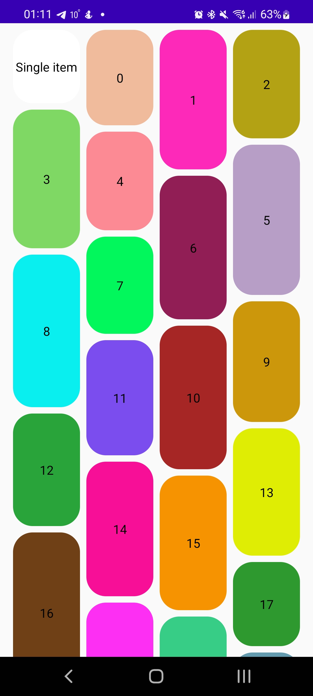

# StaggeredLazyColumn
Simple implementation of StaggeredLazyColumn with Jetpack Compose

[](https://jitpack.io/#devDebajo/staggered_lazy_column)

Used LazyLayout from Jetpack Compose 1.2.0-beta01

*Attension: unfortunetely, current implementation has low performance yet*




# Install

In project level `build.gradle` add jitpack.io repository:
```kotlin
repositories {
    maven { url 'https://jitpack.io' }
}
```

Then add it to module level `build.gradle`:
```kotlin
implementation 'com.github.devDebajo:staggered_lazy_column:{latest_version}'
```

# Usage
```kotlin
val state: State = viewModel.state.collectAsState() // State should be Stable or Immutable
StaggeredLazyColumn(
    modifier = Modifier.fillMaxSize(),
    columns = StaggeredLazyColumnCells.Adaptive(100.dp, maxColumns = 5),
    horizontalSpacing = 8.dp,
    verticalSpacing = 6.dp,
    contentPadding = PaddingValues(16.dp),
) {
    items(
        count = state.items.size,
        key = { state.items[it].id },
        contentType = { "my_type" },
    ) { index ->
        Text(state.items[index].name)
    }
}
```
For get more scrolling performance your state should be `@Stable` type\
More info about stable types and skipping recompositions when input haven't changed [here](https://developer.android.com/jetpack/compose/lifecycle#skipping)

# Roadmap
* Access to first visible index and offset
* Scrolling to item by index
* Visible items info
* Bugfixes
* Performance

License
-------

    Copyright (C) 2022 debajo

    Licensed under the Apache License, Version 2.0 (the "License");
    you may not use this file except in compliance with the License.
    You may obtain a copy of the License at

       http://www.apache.org/licenses/LICENSE-2.0

    Unless required by applicable law or agreed to in writing, software
    distributed under the License is distributed on an "AS IS" BASIS,
    WITHOUT WARRANTIES OR CONDITIONS OF ANY KIND, either express or implied.
    See the License for the specific language governing permissions and
    limitations under the License.
